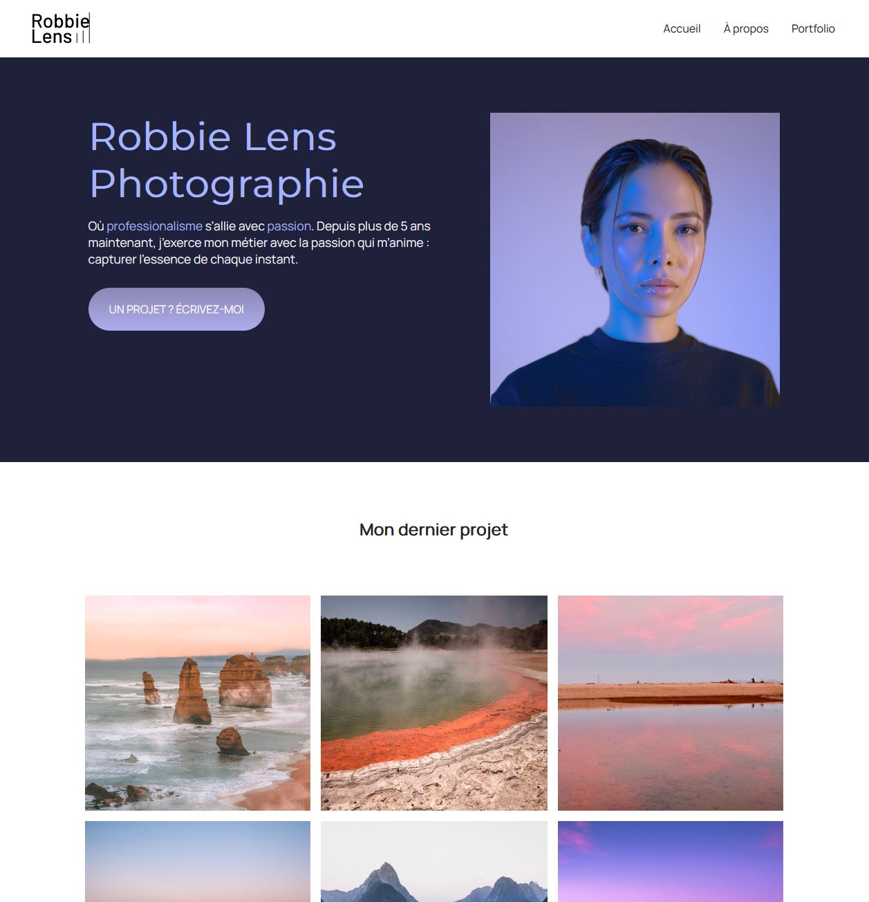

# Site vitrine - Robbie Lens Photographie

Site vitrine fictif.

Codé à partir du [fork d'OpenClassrooms](https://github.com/OpenClassrooms-Student-Center/1603881-creez-votre-site-web-avec-html5-et-css3) pour le cours [" Créez votre site web avec HTML5 et CSS3"](https://openclassrooms.com/fr/courses/1603881-creez-votre-site-web-avec-html5-et-css3).

[À essayer ici](https://simonribeiro.github.io/Site-vitrine/)
